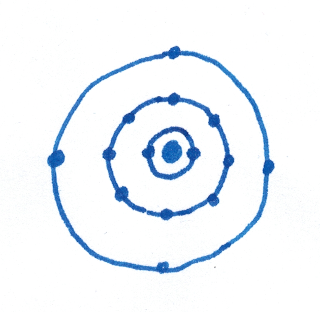
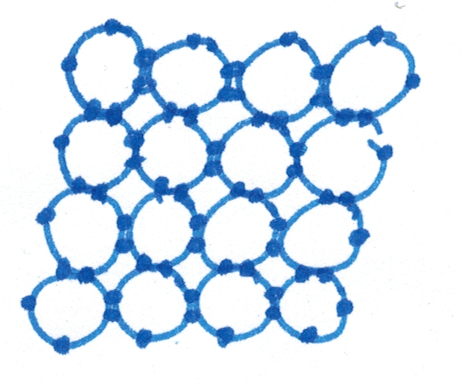
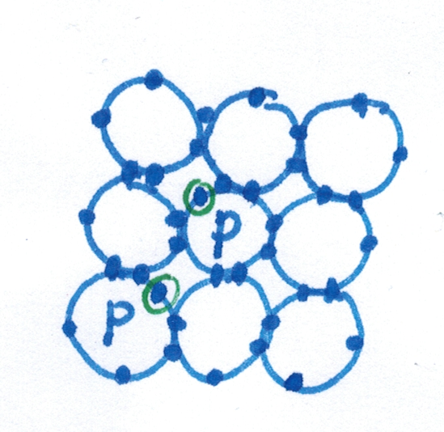
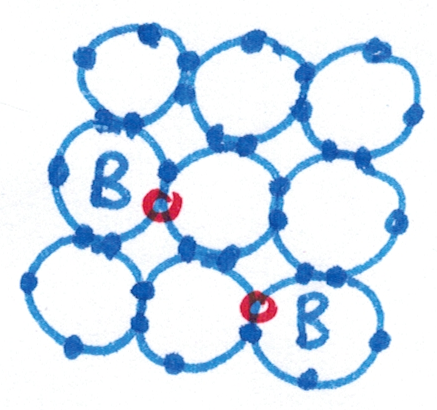
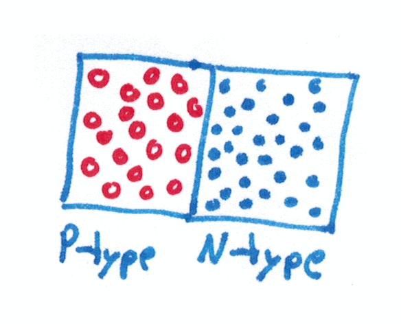
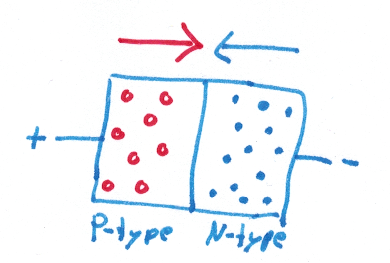
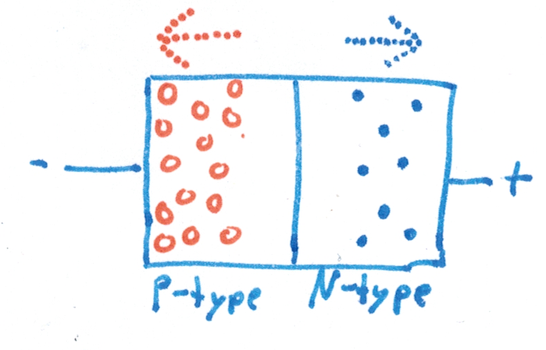

# Project Bite

## Our plan
Some time ago, I noticed how inexpensive it was to purchase transistors on Amazon. So naturally, I ordered a few hundred, which arrived a month later, as they were shipped from China. I had also ordered a few resistors and some other electronic components, so in theory I had everything required to build circuits.

After some simple experiments, I lost the will to continue, so I put the Breadboard away and left it in a drawer for half a year. When we had to choose what to do in our computer Science class, Luis and I decided to use the components to make something. We anticipated hitting some difficulties, so we decided not to set any specific goals, instead making up new goals as we went along.

## Silicone
The basic ingredient that makes modern computers possible is silicone. It is one of the most common metals on the earth, but it has a few interesting properties. Being the fourteenth element in the periodic table, it has three shells, the structure of which can be seen in this picture:

Only the outer shell is relevant for most of silicones properties. The four electrons make silicone form a crystal structure:

 

You can see that all the electrons are part of a bond between two adjacent silicone atoms. That fixes them in place and prevents them from moving around. This means that pure silicone does not conduct electricity, because it does not have any charge carriers that can move around.

We can, however, introduce more electrons into the crystal. To do that, we take the next element in the periodic table, Phosphorus, and replace a few silicone atoms with Phosphorus. This process is called doping. Having the atomic number 15, Phosphorus' outer shell contains five electrons instead of four like in silicone. When mixed into the silicone mix, the same crystal structure still forms:

However, as you can see, the extra electron (highlighted in green) is not part of any bond. Therefore, it can move around freely. This means that N-type Phosphorous (called like that because electrons are **n**egatively charged) is a conductor.

There is a second type of doped silicone. This time, the silicone is replaced with an element that has one fewer electron. The element that comes before Silicone in the periodic table is Aluminium and it is sometimes used, but most of the times, Boron (atomic number 5) is used instead. It has the same number of electrons on the outer shell as Aluminum, but allows electrons to move more freely. This type of silicone is called P-type (although one fewer electron might imply a positive charge, Boron also has one proton less, so N-type and P-type silicone is still not charged):

The orange circles represent a hole in the crystal structure. These cannot move directly, but electrons can jump out of the crystal structure into a hole, leaving another hole at their origin. This means that P-type silicone is also a conductor. While not technically correct, one can imagine the holes moving from the positive to the negative pole as positive charge carriers.

Theoretically, any element from the 13th and 15th group can be used to dope silicone, but Boron and Phosphorus are most commonly used.

## Diodes

These two types can now be combined into electronic components. The most simple one is a diode:

As you can see in the animation, the electrons close to the border jump into the holes and create a small zone that contains neither holes nor electrons. However, the region is now positively and negatively charged due to the lack of electrons in the N-type silicone and additional electrons in the P-type silicone. These charged regions become important later because they are required for a transistor to function properly.

The interesting property of diods becomes clear when a voltage is applied at both ends:

In this first case, the positive pole attrackts the electrons that are inside the P-type silicone, creating new holes as it rips them from the crystal structure. On the other side, the negative pole moves electrons into the N-type silicone. When an electron and a hole meet in the middle, they both disappear. The arrows in the image indicate the direction of movement for the holes and electrons. Because they are both moving towards the central border, where they disappear, current can flow.

If a voltage is applied the other way around, this happens:

The electrons are pulled towards the positive pole, away from the border and the holes are attrackted to the negative pole. As the empty border area gets wider and wider, the electrons and holes are now so far away from each other that they cannot diffuse into each other. Therefore, the movement stops, as no new holes and electrons can be generated in the border region. The arrows are only dotted because no current can flow.

This demonstrates why current can only flow in one direction inside a diode.
