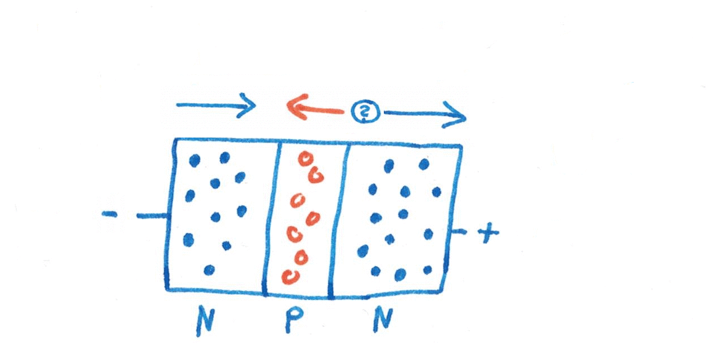
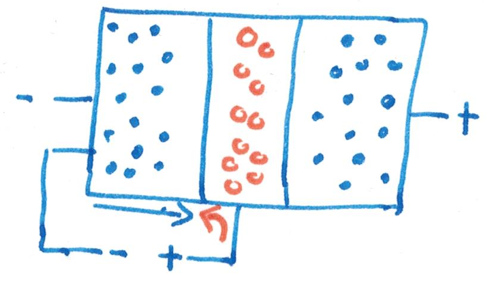
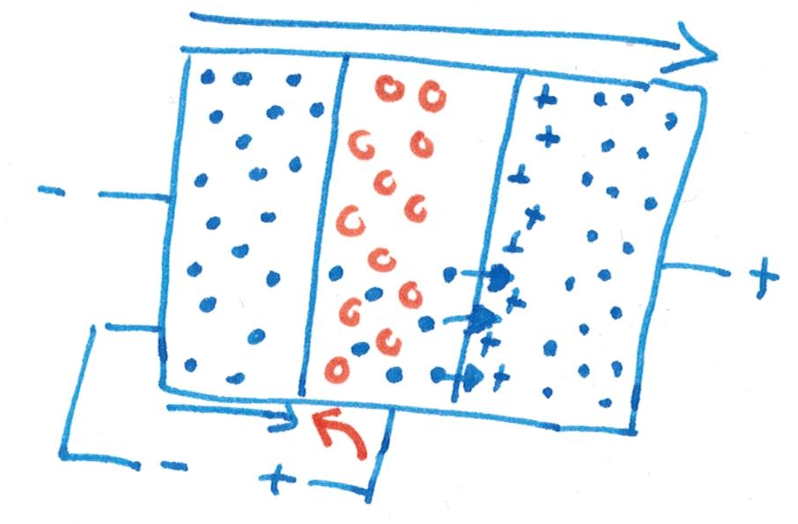
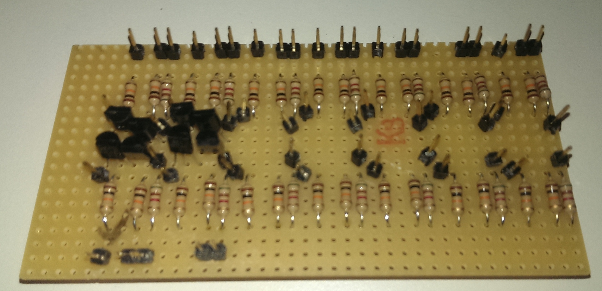

# Project Bite

## Our plan
Some time ago, I noticed how inexpensive it was to purchase transistors on Amazon. So naturally, I ordered a few hundred, which arrived a month later, as they were shipped from China. I had also ordered a few resistors and some other electronic components, so in theory I had everything required to build circuits.

After some simple experiments, I lost the will to continue, so I put the Breadboard away and left it in a drawer for half a year. When we had to choose what to do in our computer Science class, Luis and I decided to use the components to make something. We anticipated hitting some difficulties, so we decided not to set any specific goals, instead making up new goals as we went along.

## Silicone
The basic ingredient that makes modern computers possible is silicone. It is one of the most common metals on the earth, but it has a few interesting properties. Being the fourteenth element in the periodic table, it has three shells, the structure of which can be seen in this picture:


Only the outer shell is relevant for most of silicones properties. The four electrons make silicone form a crystal structure:

 

You can see that all the electrons are part of a bond between two adjacent silicone atoms. That fixes them in place and prevents them from moving around. This means that pure silicone does not conduct electricity, because it does not have any charge carriers that can move around.

We can, however, introduce more electrons into the crystal. To do that, we take the next element in the periodic table, Phosphorus, and replace a few silicone atoms with Phosphorus. This process is called doping. Having the atomic number 15, Phosphorus' outer shell contains five electrons instead of four like in silicone. When mixed into the silicone mix, the same crystal structure still forms:


However, as you can see, the extra electron (highlighted in green) is not part of any bond. Therefore, it can move around freely. This means that N-type Phosphorous (called like that because electrons are **n**egatively charged) is a conductor.

There is a second type of doped silicone. This time, the silicone is replaced with an element that has one fewer electron. The element that comes before Silicone in the periodic table is Aluminium and it is sometimes used, but most of the times, Boron (atomic number 5) is used instead. It has the same number of electrons on the outer shell as Aluminum, but allows electrons to move more freely. This type of silicone is called P-type (although one fewer electron might imply a positive charge, Boron also has one proton less, so N-type and P-type silicone is still not charged):


The orange circles represent a hole in the crystal structure. These cannot move directly, but electrons can jump out of the crystal structure into a hole, leaving another hole at their origin. This means that P-type silicone is also a conductor. While not technically correct, one can imagine the holes moving from the positive to the negative pole as positive charge carriers.

Theoretically, any element from the 13th and 15th group can be used to dope silicone, but Boron and Phosphorus are most commonly used.

## Diodes

These two types can now be combined into electronic components. The most simple one is a diode:


As you can see in the animation, the electrons close to the border jump into the holes and create a small zone that contains neither holes nor electrons. However, the region is now positively and negatively charged due to the lack of electrons in the N-type silicone and additional electrons in the P-type silicone. These charged regions become important later because they are required for a transistor to function properly.

The interesting property of diods becomes clear when a voltage is applied at both ends:


In this first case, the positive pole attrackts the electrons that are inside the P-type silicone, creating new holes as it rips them from the crystal structure. On the other side, the negative pole moves electrons into the N-type silicone. When an electron and a hole meet in the middle, they both disappear. The arrows in the image indicate the direction of movement for the holes and electrons. Because they are both moving towards the central border, where they disappear, current can flow.

If a voltage is applied the other way around, this happens:


The electrons are pulled towards the positive pole, away from the border and the holes are attrackted to the negative pole. As the empty border area gets wider and wider, the electrons and holes are now so far away from each other that they cannot diffuse into each other. Therefore, the movement stops, as no new holes and electrons can be generated in the border region. The arrows are only dotted because no current can flow.

This demonstrates why current can only flow in one direction inside a diode.

## Transistors

The next step up in complexity is a transistor. Unlike a diode, which consists of two layers of silicone, a transistor has three. We used NPN transistors:



As you can see in the animation (TODO: Is there an animation?), no current can flow through the transistor. Regardless of the direction, at one of the borders, the electrons and holes move away from each other (marked with a questionmark), which creates a scenario just like in the diode.

There is, however, a trick to make the transistor conduct electricity:



By applying a second voltage between one of the N-type parts and the middle, those two parts act like the diodes we had above. Electrons are moving from the left to the middle (which is called the base). Normally, they would all move out at the bottom, but here the charged regions near the border become important:



As the electrons move through the base, pulled be the current applied to the base and emitter (it does the exact opposite of emitting electrons, but engineers usually think of positive charge carriers, so the names emitter and collector are referring to those), they are attracted by the positive charge next to the border region. Once they cross the border region, there is a current flowing from one side of the transistor to the other one. To make this work well, the base needs to be very thin, otherwise, the electrons will not be attracted strongly enough by the positive charge.

This design turns a transistor into what can be considered an electronic switch. By applying a voltage to the base, the switch is turned on and current can flow, otherwise, current flow is prevented.

## Logic Gates

Now that we know how transistors work, we can move up one level, to logic gates. *Side note: From now on, we will assume charge flows from the plus to the minus pole, as this is how everyone does when discussing electronic circuits.* These are digital constructs that take a number of inputs (usually two) that have the value 0 or 1 (represented by connecting the input to a high or low voltage. The logic gates process those inputs in some way and then return an output, also either a 0 or a 1.

A simple logic gate is the AND gate. It only turns the output on when both inputs are on. Any gate can be represented by a truth-table (A and B are the inputs, O is the output):

|  A  |  B  |  O  |
| --- | --- | --- |
|  0  |  0  |  0  |
|  0  |  1  |  0  |
|  1  |  0  |  0  |
|  1  |  1  |  1  |

This is how an AND gate is built using transistors:

TODO: Figure 11

If both transistors are active, the current flows from the positive pole through the transistors and to the output. The pull-down resistor is required to make sure that the output is connected to the negative pole when the transistors are not both active. We learned the hard way that there is a distinction between having something disconnected and connecting it to the negative pole.

Because we assumed that having quite a few AND gates would be helpful, we devised an efficient layout so we could fit as many as possible onto a small copper-plated plastic board. Here are some pictures of the soldering process:



We also built a few NAND gates, which are quite similar to the AND gate, except that they output the inverse:

|  A  |  B  |  O  |
| --- | --- | --- |
|  0  |  0  |  1  |
|  0  |  1  |  1  |
|  1  |  0  |  1  |
|  1  |  1  |  0  |

Unfortunately, it was not uncommon for a few gates not to work. This was quite frustrating, so we decided to create an automated testing machine. The Raspberry Pi was a good fit for that job, as the GPIO pins allowed us to easily connect the Pi to the gate.

The code for that project is in a separate respository: [pythonGateChecker](https://github.com/LuisBerserker/pythonGateChecker)

Here's a summary of how the program works:

After setting the variables up and printing a list of all the pins that need to be connected, the program sets poth inputs to False and samples the output:

```python
print("A     B        O")
GPIO.output(7, False)
GPIO.output(11, False)
time.sleep(0.1)
valueNow=reliableInput(InputPos)
```

The function *reliableInput* was necessary to get a good output reading. It samples the output 100 times, pausing 10ms between each sample. It counts how often the output is true and false.

```python
def reliableInput(pin):
        amountTrue=0
        amountFalse=0
        testCount=100
        for num in range(0,testCount):
                if(GPIO.input(pin)):
                        amountTrue = amountTrue+1
                else:
                        amountFalse= amountFalse+1
time.sleep(0.01)
```

After that, we check whether both true and false account for more than 30 percent of the samples:

```python
if(amountTrue>(.3*testCount)and amountFalse>(.3*testCount) ):
    print ("Insufficient: %True=" + str(100*amountTrue/testCount) + "  %False=" + str(100*amountFalse/testCount)+"   Continuing anyway...")

```

In that case, there is probably some error and the gate is just outputting random values, so the test is invalid. Otherwise, we simply compare the amount of true and false returns and return the value:

```python
if(amountTrue>=amountFalse):
            return True
        else :
            return False
```

Most of the times, the output is distributed 100:0, but there were a few cases where a working gate returned a few wrong outputs (we're not quite sure why, but assume those values happen close to the switching of the inputs).

We now check all four input combinations and record the outputs in the array *GPIOoutputList*. After we're done with that, we can check the combination of outputs and detect the gate:

```python
gate= False

if(GPIOoutputList[0]==False
and GPIOoutputList[1]==False
and GPIOoutputList[2]==False
and GPIOoutputList[3]==True ):
        gate=True
        print("---------------")
        print("")
        print("AND GATE")
        print("")
print("----------------")
```

We do this for all gates. Should the variable *gate* still be false at the end, we print an error message.

```python
if(not gate):
        print("-------ERROR--------")
        print("")
        print("ERROR:    -----NOT A GATE-----     ERROR")
        print("")
print("-------ERROR---------")
```

In that case, the gate is not working. Most of the time, this happens because the output is always false.

## More complicated circuits

This is the point where we made a mistake. We had working AND, NAND and even XOR gates (the latter require 6 transistors and are therefore a lot more error-prone. We now planned to use those gates to build a more complicated circuit. Instead, we probably should have ordered a few integrated circuits. They are simply, fairly cheap components that contain a few logic gates. This would have allowed us to focus more on building the circuits and less on fixing the gates.

However, we didn't realize this until too late, which slowed our progress down quite a lot.

We were considering a few things:

+ **A brainfuck computer**
  This was a completely crazy idea. Brainfuck is a simple and strange programming language. It consists of a series of cells. The program can move a pointer along those cells and can increase or decrease the value in those cells. The last commands are loops, which are executed until the cell is 0. In spite of this simplicity, Brainfuck is turing complete. This would have been the easiest programming language to implement and with integrated circuits and without the Abitur, we might have succeeded in implementing at least part of the functions (loops are the most complicated), but quickly removed that idea from our list.
+ **An adder**
  Using AND and XOR gates, one can build an adder. That is a circuit that takes two inputs consisting of *n* bytes and ouputs the sum of those binary numbers in a *n + 1* long binary number. This would have been feasible to construct, but we decided not to do this because we didn't find it particularly interesting.
+ **A clock / counter**
  Here the idea is to have an oscillating time source (real clocks use crystals, we were planning to use a capacitor that charges and discharges in a fairly constant period). This switching of currents then triggers a change in some kind of counting circuit that counts how often the time source signal has changed. This idea seemed both fun and doable in the short timeframe.

## Binary Counter

After doing some research, we found out that the best way to build a counter is to chain a series of clocked JK flipflops together. In general, a flipflop is a circuit that can flip between two states. By using the J and K input pins of a JK flipflop, we can set it to 0 or 1 and it will remain in that state even after the inputn pin is turned off. Because it is a clocked flipflop, it has a third input pin that receives a clock signal. This clock signal periodically turns on and off. Whenever the switch from off to on occurs (called the *rising edge*), the flipflip accepts the state change signaled by the J and K input pin.

For our counter, we use a trick: When both J and K are turned on, the flipflop will change its state every time the rising edge occurs. Because the flipflop only triggers on the rising edge, the output has half the frequency of the input. By chaining multiple JK fliplops together, with the output of one feeding into the clock of the next one, we can create this cascade-like effect:

TODO: Figure 12

This is exactly what we want: A binary counter. 

We built a total of four flipflops, each of them consisting of four NAND gates and one AND gate. The wiring is quite complicated, because the outputs are fed back into the inputs.

Three of the four flipflops worked (we were unable to determine the fault in the broken flipflop), so we tried chaining them together. This, however, was rather unsuccessful.

The first issue we ran into was that our clock sources was not producing a clean signal. We used a button which we operated manually, but the button has a tendency to bounce, creating multiple rising edges a few milliseconds apart. We were able to mitigate this effect by adding a capacitor to the button. Because the capacitor needs some time to charge, the small bounces are evened out.

The second problem was on a more fundamental level. All the time, we had assumed that transistors were binary switches that only had an on and an off state. In practise, that is not the case. Depending on the voltage at base and collector, a transistor might not be fully saturated. Current will flow from collector to emitter, but it is proportional to the base voltage. This results in situations where the input voltage at the next transistor is not high enough to turn it on and similar errors.

We were unable to fix those issues at the time of writing, so here are a few pictures of us building the circuits instead:

## Sources

[How a transistor works *by Ben Eater, last accessed on March 23rd, 2017*](https://www.youtube.com/watch?v=DXvAlwMAxiA)
[Logic gate circuit diagrams](http://hyperphysics.phy-astr.gsu.edu/hbase/Electronic/trangate.html)
